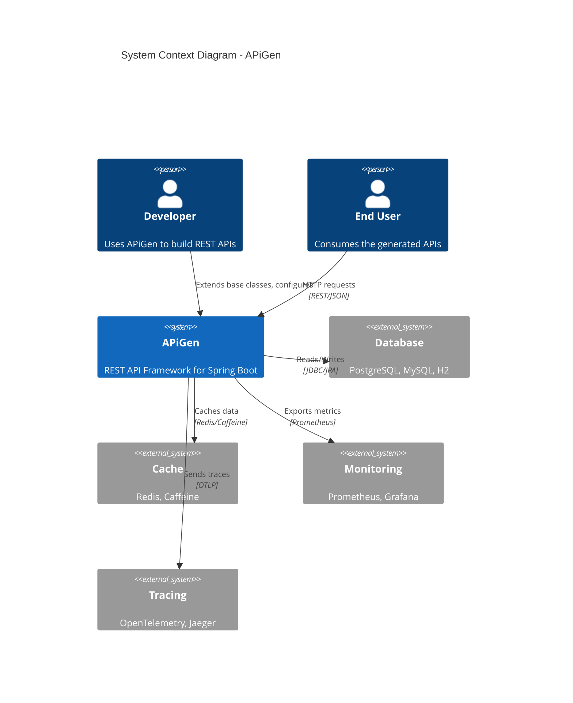
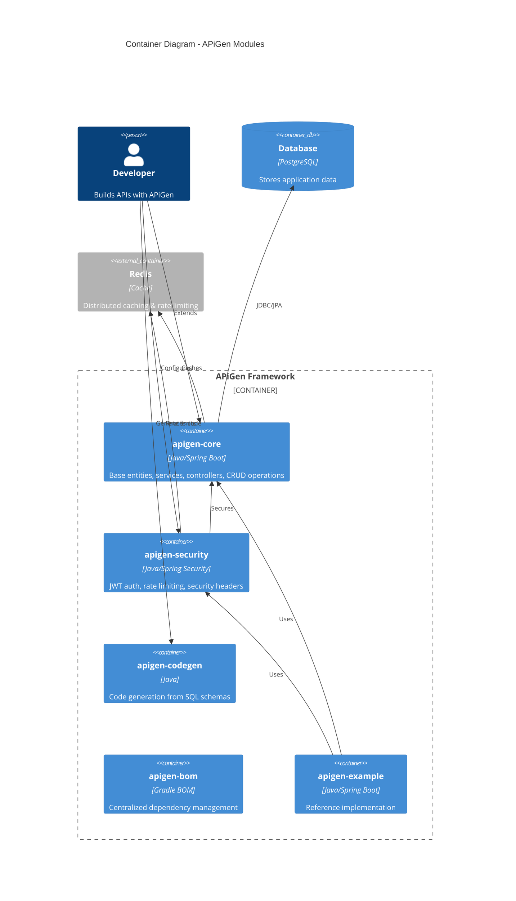
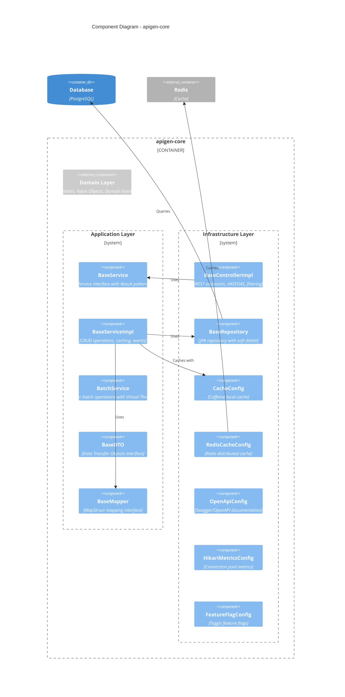
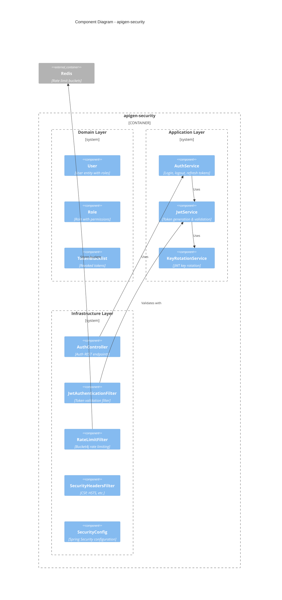
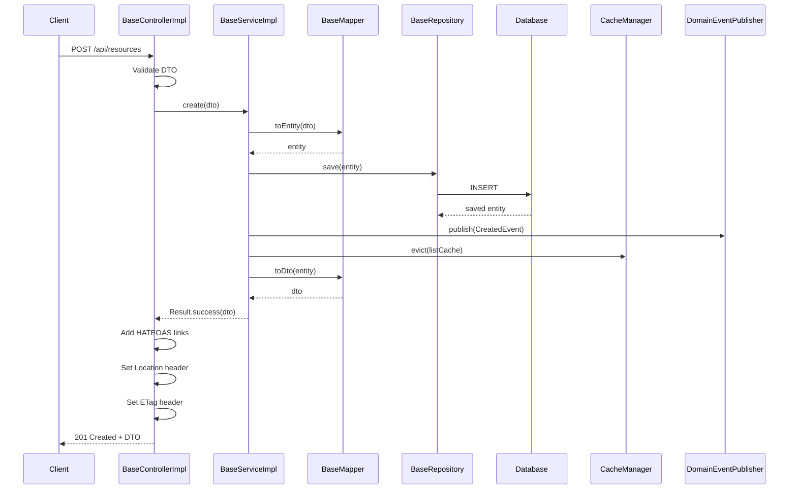
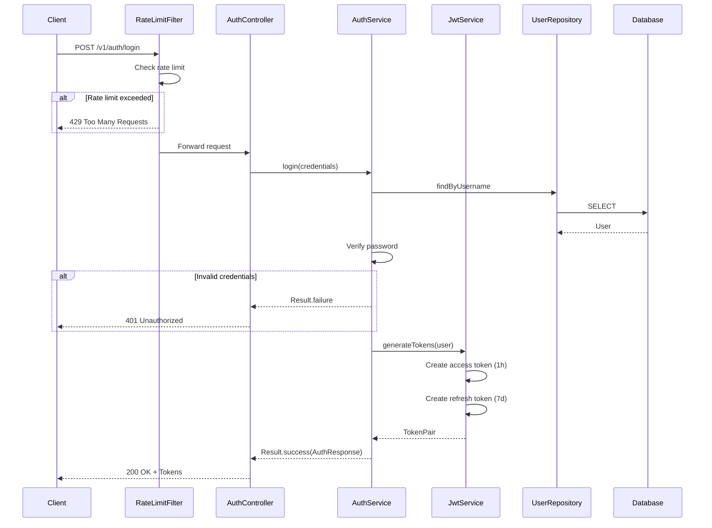
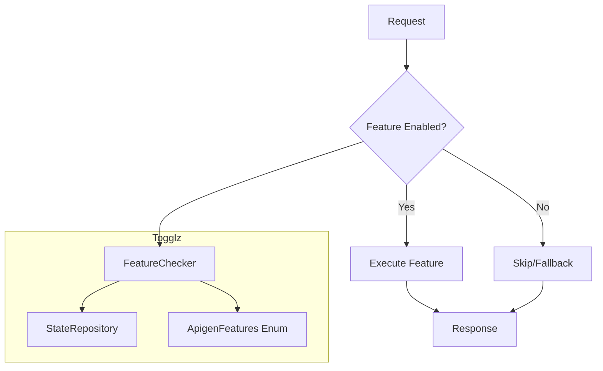
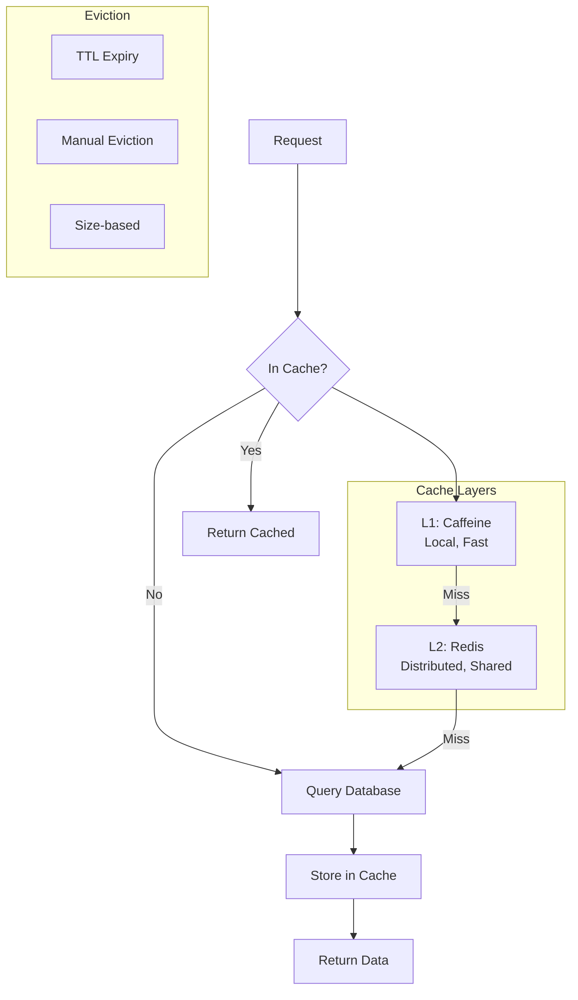
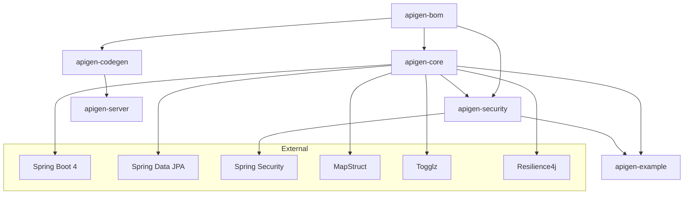
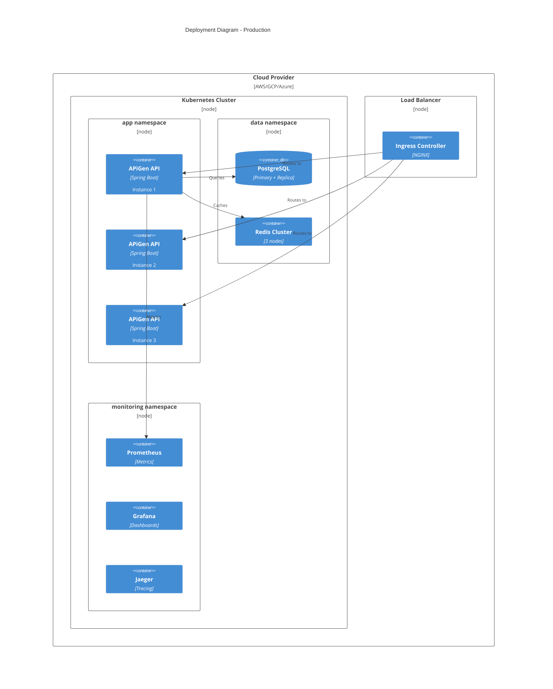

# APiGen Architecture - C4 Model

This document describes the APiGen architecture using the C4 model with Mermaid diagrams.

## Level 1: System Context Diagram

Shows how APiGen fits into the broader system landscape.

## Level 2: Container Diagram

Shows the major modules that compose APiGen.

## Level 3: Component Diagram - Core Module

Shows the internal components of apigen-core following hexagonal architecture.

## Level 3: Component Diagram - Security Module

Shows the internal components of apigen-security.

## Data Flow: Create Resource

## Data Flow: Authentication

## Feature Flag Flow

## Caching Strategy

## Module Dependencies

## Deployment Architecture

---

## Legend

| Symbol | Meaning |
|--------|---------|
| Person | Human user/actor |
| System | Software system |
| Container | Deployable unit (JAR, service) |
| Component | Code module/package |
| Database | Data store |
| _Ext | External system |

## References

- [C4 Model](https://c4model.com/)
- [Mermaid C4 Diagrams](https://mermaid.js.org/syntax/c4.html)
- [APiGen Source](https://github.com/JNZader/apigen)
